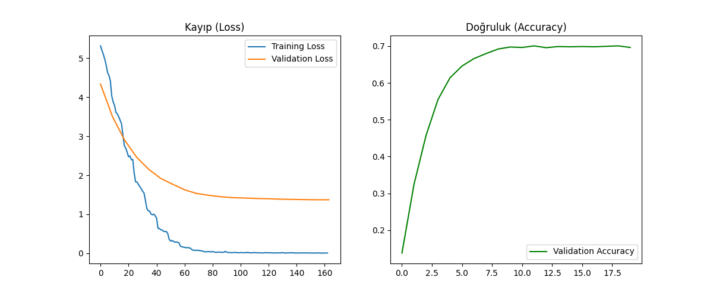

# 🚗 CarVision AI - Yapay Zeka Destekli Araç Sınıflandırma


**CarVision AI**, Vision Transformer (ViT) mimarisini kullanarak araçların marka, model ve üretim yıllarını fotoğraftan tespit eden derin öğrenme tabanlı bir görüntü sınıflandırma projesidir.

---

## 🎯 Proje Hakkında

Bu proje, **"Yapay Zeka ve Bulut Bilişim Teknolojileri"** dersi kapsamında geliştirilmiştir. Amaç, karmaşık görsel verileri işleyebilen, yüksek doğruluk oranına sahip bir yapay zeka modeli eğitmek ve bunu son kullanıcı için erişilebilir bir web arayüzüne dönüştürmektir.

Proje, klasik CNN (Convolutional Neural Network) modelleri yerine, görüntü işlemede yeni nesil standart haline gelen **Google ViT (Vision Transformer)** mimarisini kullanır.

### ✨ Temel Özellikler
* **Kapsamlı Veri Seti:** Stanford Cars veri seti kullanılarak **196 farklı araba sınıfı** üzerinde eğitim gerçekleştirilmiştir.
* **Transformer Mimarisi:** Google'ın `vit-base-patch16-224` modeli üzerinde Fine-Tuning (İnce Ayar) yapılmıştır.
* **Modern Arayüz:** Streamlit ile geliştirilmiş, kullanıcı dostu ve responsive web arayüzü.
* **Detaylı Analiz:** Sadece tek bir tahmin değil, **Top-5 Olasılık Dağılımı** ile modelin alternatif tahminleri sunulur.
* **Akıllı Ön İşleme:** Görüntüleri modelin eğitim formatına uygun hale getiren otomatik kırpma (Center Crop) ve normalizasyon işlemleri.

---

## 📂 Veri Seti Detayları

Bu projede **Stanford Cars Dataset** kullanılmıştır.

* **Sınıf Sayısı:** 196 Adet
* **Kapsanan Yıllar:** 1991 - 2012
* **Araç Türleri:** Sedan, SUV, Coupe, Convertible, Pickup, Hatchback vb.
* **İçerik:** Audi, BMW, Mercedes, Ford gibi dünya genelindeki popüler markaların 2012 yılına kadar olan ikonik modellerini içerir.

> **⚠️ Önemli Not:** Veri setinin doğası gereği, model **2013 ve sonrası** üretilen modern araçları (örn: Togg T10X, Tesla Model Y) veya veri setinde bulunmayan modelleri tanımayabilir. 

---

## 🛠️ Kullanılan Teknolojiler

| Alan | Teknoloji / Kütüphane | Açıklama |
| :--- | :--- | :--- |
| **Dil** | Python 3.10 | Ana programlama dili |
| **Model** | Hugging Face Transformers | ViT modeli ve işlemcisi |
| **Framework** | PyTorch (CUDA) | Model eğitimi ve tensor işlemleri |
| **Arayüz** | Streamlit | Web tabanlı kullanıcı arayüzü |
| **Veri İşleme** | Torchvision & PIL | Görüntü kırpma, yeniden boyutlandırma |

---

## 📊 Model Performansı ve Eğitim Süreci

Model eğitimi NVIDIA RTX 3060 GPU üzerinde gerçekleştirilmiştir. Eğitim sürecinde **Overfitting (Ezberleme)** riskini azaltmak için aşağıdaki teknikler uygulanmıştır:

1.  **Data Augmentation (Veri Çoğaltma):**
    * Random Horizontal Flip (Yatay Çevirme)
    * Random Rotation (Döndürme - 15 derece)
    * Color Jitter (Parlaklık ve Kontrast değişimi)
2.  **Label Smoothing:** Modelin çok keskin kararlar vermesini engelleyerek genelleme yeteneği artırıldı.

### Sonuçlar
* **Eğitim Süresi:** 20 Epoch
* **Doğruluk (Accuracy):** %70+
* **Test Yöntemi:** Top-5 Accuracy ve Confidence Score analizi.




---

## 🚀 Kurulum ve Çalıştırma

Projeyi kendi bilgisayarınızda çalıştırmak için aşağıdaki adımları izleyin.

### 1. Projeyi Klonlayın

Dataset Drive Linki: -----------------------
Eğitilmiş Model Linki: --------------------- 

```bash
git clone [https://github.com/Bozokhalat/CarVision-AI.git](https://github.com/Bozokhalat/CarVision-AI.git)

cd CarVision-AI
